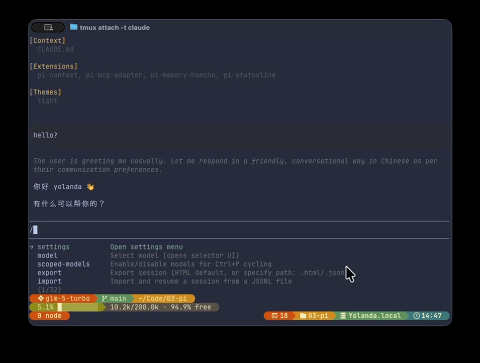
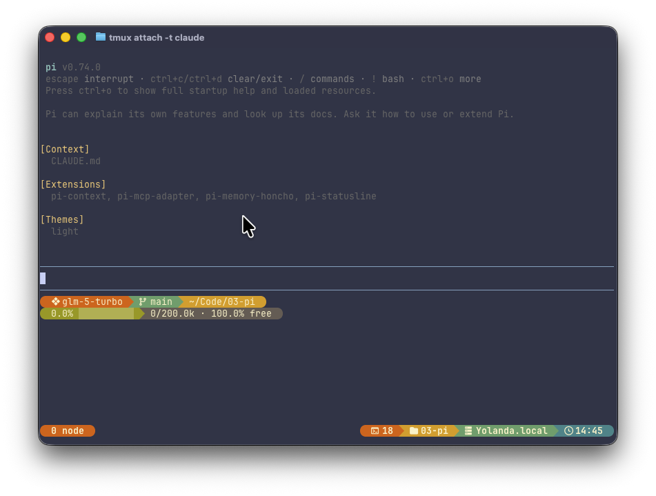

<div align="center">

<h1>PI Extensions</h1>

[PI coding agent](https://github.com/badlogic/pi-mono) 的个人扩展集合。提供持久化记忆、上下文可视化、交互式问卷和胶囊风格状态栏。

**[中文](README.zh.md)** | **[English](README.md)**

</div>

---

## 核心功能

### pi-memory-honcho

基于 Honcho 的持久化记忆扩展，支持辩证推理。跨会话存储用户偏好和事实，在关联的 AI 工具工作区之间共享记忆，通过可配置的召回模式将上下文注入系统提示词。

> Fork 自 [acsezen/pi-memory-honcho](https://github.com/acsezen/pi-memory-honcho)。

### pi-context

上下文窗口可视化命令（`/context`）。以 token 网格展示各类别占用：系统提示词、工具定义、消息、可用空间、自动压缩预留。



### pi-questionnaire

交互式单/多问题 UI 工具。支持单选和多选模式，含标签页导航、自定义文本输入和行内自动补全。

### pi-statusline

受 [Starship](https://starship.rs/) 启发的持久化双行胶囊状态栏。显示模型名称、思考级别、Git 分支、代码变更、工作目录和上下文使用率，采用 Powerline 分隔符和 Gruvbox Dark 配色。



## 快速开始

在 PI 中安装扩展：

```bash
pi install npm:@that-yolanda/pi-memory-honcho
pi install npm:@that-yolanda/pi-context
pi install npm:@that-yolanda/pi-questionnaire
pi install npm:@that-yolanda/pi-statusline
```

各扩展的具体配置请参阅其 README。

## 开发指南

### 环境准备

- [Node.js](https://nodejs.org/) >= 22
- [pnpm](https://pnpm.io/) >= 10

### 安装依赖

```bash
git clone https://github.com/that-yolanda/pi-extensions.git
cd pi-extensions
pnpm install
```

### 常用命令

```bash
# Lint & 格式化
pnpm check
pnpm fix

# 运行全部测试
pnpm test

# 单个扩展
pnpm --filter pi-memory-honcho test
pnpm --filter pi-memory-honcho typecheck
```

## 参考文档

- [pi-memory-honcho README](pi-memory-honcho/README.md)
- [pi-context README](pi-context/README.md)
- [pi-statusline README](pi-statusline/README.md)
- [pi-questionnaire README](pi-questionnaire/README.md)

## License

[MIT](LICENSE)
